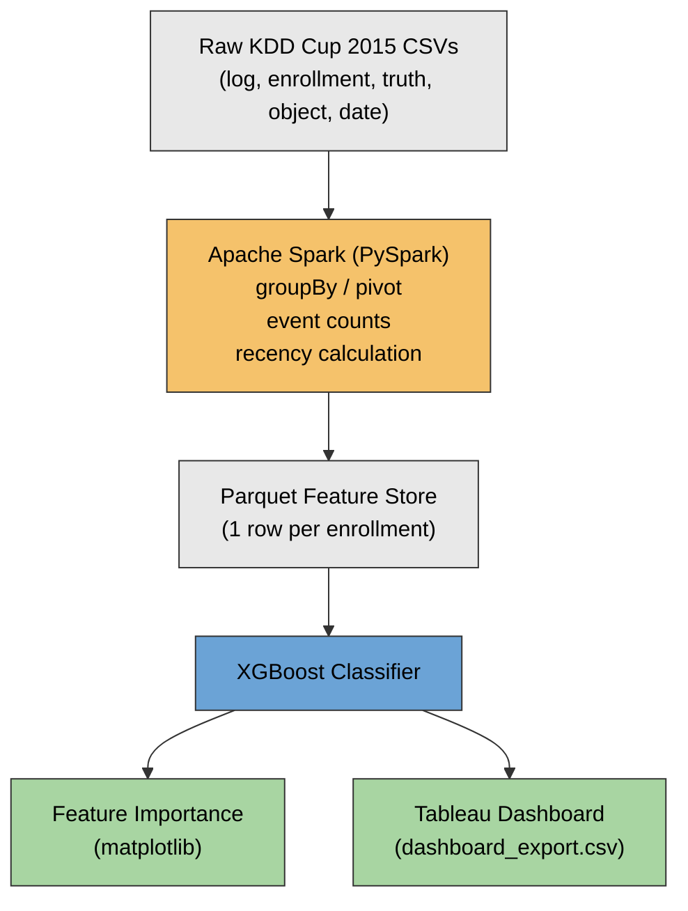

# Student Dropout Prediction - KDD Cup 2015

A big data pipeline for predicting student dropout in MOOCs, using distributed
feature engineering on clickstream logs and a gradient-boosted classifier.

## Problem

MOOC dropout rates commonly exceed 90%. This project predicts, per enrollment,
whether a student will drop out of a course based on their early engagement
patterns - clicks, video views, problem attempts, and activity timing.

## Dataset

**KDD Cup 2015** - https://www.kaggle.com/datasets/sst2023/kdd-cup-2015

- 120,542 enrollments, 79,186 students, 39 courses
- 8,157,277 clickstream log events
- Class distribution: 79.3% dropout, 20.7% retained

## Architecture




## Features engineered

| Feature | Description |
|---|---|
| `active_days` | Distinct days with any activity |
| `total_events` | Total log events |
| `server_events` / `browser_events` | Split by log source |
| `access_count`, `problem_count`, `video_count`, `discussion_count`, `wiki_count`, `navigate_count`, `page_close_count` | Event-type counts |
| `distinct_objects_touched` | Unique course objects interacted with |
| `days_before_course_end` | Recency of last activity relative to course end |
| `session_span_days` | Days between first and last activity |
| `events_per_active_day` | Activity intensity |

## Results

| Metric | Model | Baseline (always predict dropout) |
|---|---|---|
| AUC | 0.879 | - |
| Accuracy | 83% | 79% |
| Class 0 (retained) recall | 76% | 0% |
| Class 1 (dropout) recall | 85% | 100% |

The baseline achieves 79% accuracy purely by exploiting class imbalance but
never identifies a single retained student. The model trades a small amount
of raw accuracy for genuine predictive signal on both classes.

**Top predictive features:** `active_days` (63%), `server_events` (13%),
`days_before_course_end` (10%) - together accounting for ~87% of the model's
decision-making.

## Tech stack

- **Apache Spark (PySpark)** - distributed feature engineering over 8M log rows
- **Parquet** - intermediate feature storage
- **XGBoost** - dropout classification
- **Tableau** - dashboard and visualization
- **pandas / scikit-learn** - data joining, train/test split, evaluation

## Project structure

```
|-- data/                        # gitignored - see data/README.md
|-- src/
|   |-- 01_explore.py             # pandas exploration of small tables
|   |-- 02_spark_explore.py       # Spark schema/event exploration of logs
|   |-- 03_feature_engineering.py # Spark aggregation -> features_train.parquet
|   |-- 04_train_model.py         # XGBoost training + evaluation
|   |-- 05_feature_importance.py  # feature importance plot
|   |-- 06_export_for_viz.py      # CSV export for Tableau
|-- dashboard_export.csv          # feature+label data for dashboard
|-- feature_importance.png
|-- model_xgb.json
|-- requirements.txt
```

## How to run

```bash
python -m venv venv
source venv/bin/activate
pip install -r requirements.txt

# download dataset from Kaggle link above, place in data/ per data/README.md

python src/01_explore.py
python src/02_spark_explore.py
python src/03_feature_engineering.py
python src/04_train_model.py
python src/05_feature_importance.py
python src/06_export_for_viz.py
```

